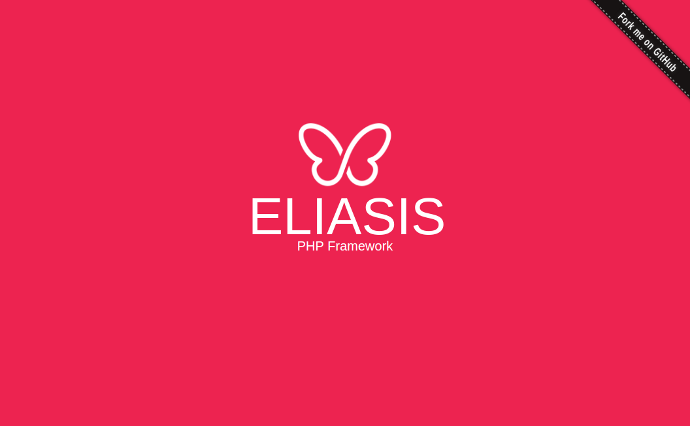

# Eliasis PHP Framework

[](https://packagist.org/packages/eliasis-framework/eliasis) [](https://packagist.org/packages/eliasis-framework/eliasis) [](https://packagist.org/packages/eliasis-framework/eliasis) [](https://packagist.org/packages/eliasis-framework/eliasis)

[English version](README-ES.md)



---

- [Instalación](#instalación)
- [Requisitos](#requisitos)
- [Cómo empezar y ejemplos](#cómo-empezar-y-ejemplos)
- [Contribuir](#contribuir)
- [Licencia](#licencia)
- [Copyright](#copyright)

---

### Instalación 

Puedes instalar Eliasis PHP Framework en tu proyecto utilizando [Composer](http://getcomposer.org/download/). Si vas a empezar un nuevo proyecto, recomendamos utilizar nuestra [app básica](https://github.com/eliasis-framework/app) como punto de partida. Para aplicaciones existentes puedes ejecutar lo siguiente:

    $ composer require eliasis-framework/eliasis

### Requisitos

Este framework es soportado por versiones de PHP 5.6 o superiores y es compatible con versiones de HHVM 3.0 o superiores.

### Cómo empezar y ejemplos

Para utilizar esta librería, simplemente:

```php
$DS = DIRECTORY_SEPARATOR;

require dirname(__DIR__) . $DS . 'lib' . $DS . 'vendor' . $DS .'autoload.php';

use Eliasis\App\App;

new App(dirname(__DIR__));
```

### Contribuir
1. Comprobar si hay incidencias abiertas o abrir una nueva para iniciar una discusión en torno a un fallo o función.
1. Bifurca la rama del repositorio en GitHub para iniciar la operación de ajuste.
1. Escribe una o más pruebas para la nueva característica o expón el error.
1. Haz cambios en el código para implementar la característica o reparar el fallo.
1. Envía pull request para fusionar los cambios y que sean publicados.

Esto está pensado para proyectos grandes y de larga duración.

### Licencia

Este proyecto está licenciado bajo la **licencia MIT**. Consulta el archivo [LICENSE](LICENSE) para más información.

## Copyright

2017 Josantonius, [josantonius.com](https://josantonius.com/)

Si te ha resultado útil... ¡házmelo saber! Sígueme en [Twitter](https://twitter.com/Josantonius).